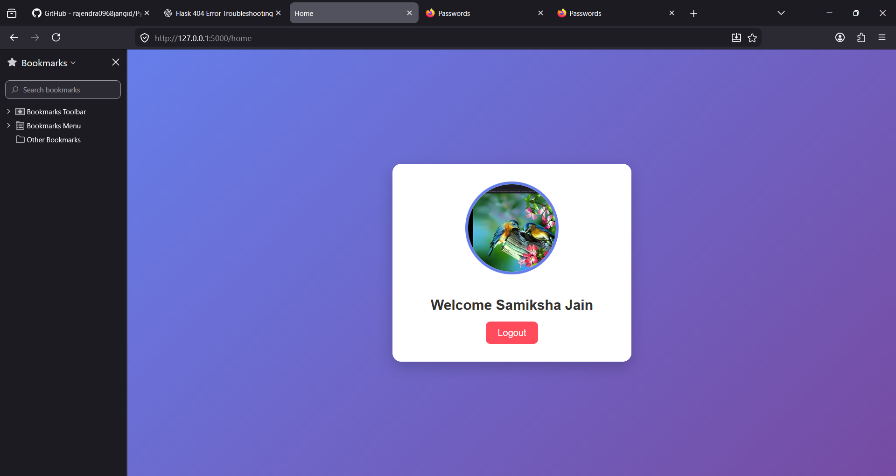

# Python-S3-RDS


## Overview

Python-S3-RDS is a cloud-integrated web application developed using Flask, Amazon S3, and Amazon RDS MySQL.

The application demonstrates how to build a web application that securely stores user information in a MySQL database hosted on Amazon RDS while uploading user files directly to Amazon S3.

This project provides practical experience with AWS cloud services, database integration, and backend web development using Python.

---

## Features

- User Registration
- User Login
- Amazon S3 File Upload
- Amazon RDS MySQL Integration
- Flask Backend
- Database CRUD Operations
- Secure Cloud Storage
- Modular Configuration

---

## Tech Stack

| Technology | Purpose |
|------------|---------|
| Python | Backend |
| Flask | Web Framework |
| Amazon S3 | File Storage |
| Amazon RDS | MySQL Database |
| MySQL | Relational Database |
| Boto3 | AWS SDK |
| HTML | Frontend |
| CSS | Styling |

---

## Project Structure

```
Python-S3-RDS/
│
├── templates/
│ ├── index.html
│ ├── login.html
│ └── register.html
│
├── app.py
├── config.py
├── requirements.txt
├── README.md
└── python-s3-rds.png
```

---

## Architecture



---

## Installation

Clone the repository

```bash
git clone https://github.com/Samiksha711/Python-S3-RDS.git
```

Move into the project

```bash
cd Python-S3-RDS
```

Create a virtual environment

```bash
python -m venv venv
```

Activate it

Windows

```bash
venv\Scripts\activate
```

Install dependencies

```bash
pip install -r requirements.txt
```

Run the application

```bash
python app.py
```

---

## AWS Services Used

- Amazon S3
- Amazon RDS MySQL
- IAM
- Boto3 SDK

---

## Learning Outcomes

- Cloud storage integration using Amazon S3
- Database connectivity with Amazon RDS
- Flask web development
- AWS SDK (Boto3)
- Secure configuration management
- File upload handling
- SQL database operations

---

## Future Improvements

- Password hashing
- User authentication using Flask-Login
- Docker support
- Deployment on EC2
- CI/CD with GitHub Actions
- Responsive UI improvements

---

## Author

**Samiksha Jain**

GitHub:
https://github.com/Samiksha711


---
